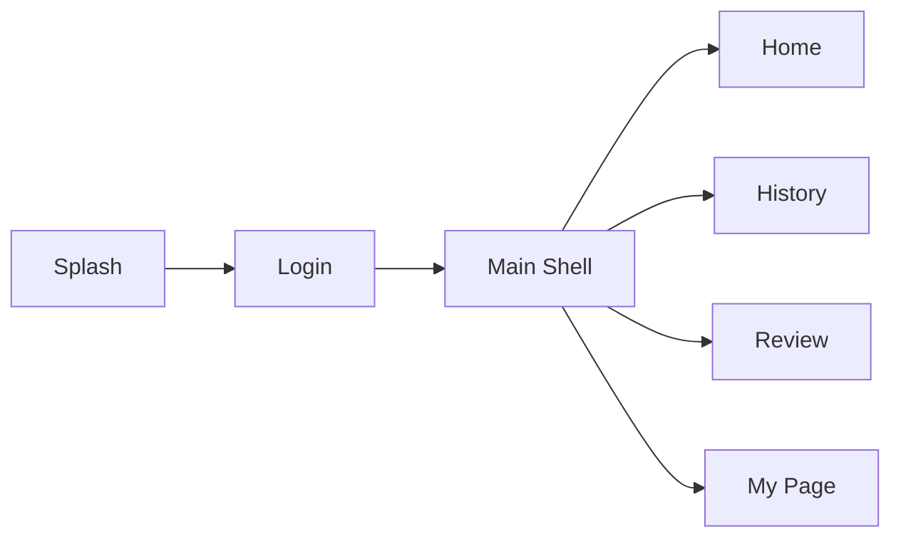

# Quiket

학습 자료를 퀴즈와 복습 흐름으로 연결하기 위한 Android 학습 관리 앱입니다.

Quiket은 과목별 학습 기록, 문제 풀이, 오답 복습, 학습 성장을 하나의 흐름으로 묶는 것을 목표로 개발 중인 프로젝트입니다. 현재 저장소는 실제 서비스 기능을 붙이기 전 단계에서 앱의 기본 흐름, 멀티 모듈 구조, 공통 아키텍처, 그리고 기술 검증용 vertical slice를 구축한 상태입니다.

## Project Overview

Quiket은 사용자가 학습 자료를 기반으로 문제를 풀고, 결과를 기록하며, 틀린 문제를 다시 복습할 수 있는 앱을 지향합니다.

현재 구현된 앱 흐름은 `Splash -> Login -> Main`이며, `Main`은 네 개의 바텀 탭을 조립하는 shell 역할을 합니다.

- `홈`: 오늘의 학습 상태와 추천 문제를 보여줄 메인 탭
- `기록`: 일자별 학습 기록과 통계를 확인할 탭
- `오답노트`: 틀린 문제를 다시 정리하고 복습할 탭
- `마이`: 계정과 학습 환경을 관리할 탭

실제 비즈니스 기능은 feature 모듈 단위로 확장할 수 있도록 분리되어 있으며, `feature:sample`에는 Hilt, Retrofit, Room, Paging3, Compose, lightweight MVI를 묶은 참고 구현이 포함되어 있습니다.

## Tech Stack

| Area | Stack |
| --- | --- |
| Language | Kotlin |
| UI | Jetpack Compose, Material3 |
| Architecture | Feature-first multi-module, lightweight MVI/UDF |
| DI | Hilt |
| Network | Retrofit, OkHttp, kotlinx.serialization |
| Local DB | Room |
| Async | Coroutines, Flow |
| Pagination | Paging3 |
| Test | JUnit4, Robolectric, Truth, Turbine, Compose UI Test |
| Build | Gradle Kotlin DSL, Version Catalog, convention plugins |

## Architecture

이 프로젝트는 `app -> feature -> core` 방향의 의존성을 유지합니다. `app` 모듈은 조립만 담당하고, 화면과 기능은 각 feature 모듈이 소유합니다. 공통 런타임 코드와 인프라 코드는 core 모듈에 배치했습니다.

```text
Quiket/
├── app/                  # Application, MainActivity, root NavHost
├── build-logic/          # Android/Compose convention plugins
├── core/
│   ├── common/           # MVI base, dispatcher, result abstraction
│   ├── database/         # Room database, DAO, entity
│   ├── designsystem/     # Theme, typography, common UI components
│   ├── navigation/       # Destination contract
│   ├── network/          # Json, OkHttp, Retrofit setup
│   └── testing/          # Test rules and shared test utilities
└── feature/
    ├── splash/           # App entry decision screen
    ├── login/            # Login entry screen
    ├── main/             # Bottom tab shell
    ├── home/             # Home tab
    ├── history/          # Learning history tab
    ├── review/           # Wrong-answer review tab
    ├── mypage/           # My page tab
    └── sample/           # Reference vertical slice
```

### Navigation Flow



각 feature는 아래 패턴을 기준으로 구성합니다.

- `Destination`: route 문자열 정의
- `Navigation`: `NavGraphBuilder` 확장 함수로 graph 등록
- `Route`: ViewModel 주입, state/effect 수집, navigation callback 연결
- `Screen`: 상태를 받아 UI만 렌더링하는 순수 Compose 화면

## Implementation Highlights

### Feature-first modularization

`feature:main`은 비즈니스 로직을 갖지 않고 바텀 탭 shell만 담당합니다. 실제 탭 기능은 `home`, `history`, `review`, `mypage`가 각각 소유하도록 나누어 기능 추가 시 변경 범위를 좁혔습니다.

### Lightweight MVI

`core:common`의 `MviViewModel`은 `StateFlow` 기반 화면 상태, `SharedFlow` 기반 one-shot effect, `Intent` 진입점을 제공합니다. 화면 상태와 사용자 액션, 일회성 이벤트를 분리해 Compose UI가 단방향 데이터 흐름을 따르도록 설계했습니다.

### Shared infrastructure

`core:network`는 Retrofit, OkHttp, kotlinx.serialization 설정을 제공하고, `core:database`는 Room 기반 shared database를 담당합니다. 특정 feature에서만 쓰는 mapper나 repository는 feature 내부에 유지해 core가 불필요하게 커지는 것을 피했습니다.

### Reference vertical slice

`feature:sample`은 PokéAPI 기반 샘플 기능입니다. 실제 서비스 엔트리와 분리되어 있지만, 다음 구현 패턴을 검증하는 기준 코드로 사용합니다.

- Paging3를 이용한 네트워크 목록 로딩
- Room을 이용한 좋아요 데이터 저장
- Repository를 통한 remote/local data source 조합
- Hilt 기반 의존성 주입
- Compose UI의 loading, empty, error, retry 상태 처리
- ViewModel, PagingSource, Repository 단위 테스트

## Current Status

현재 구현된 범위는 다음과 같습니다.

- Android 멀티 모듈 프로젝트 구성
- Gradle convention plugin 및 version catalog 구성
- Splash, Login, Main shell 앱 흐름
- Home, History, Review, MyPage 탭 모듈 분리
- Design system 초기 구성: Pretendard font, Material3 theme, 공통 top bar/button
- Core network/database/common/testing 모듈 구성
- Hilt, Retrofit, Room, Paging3를 검증하는 sample feature
- Sample feature 단위 테스트 및 Compose UI smoke test

아직 실제 인증, 학습 기록, 퀴즈 생성, 오답노트 비즈니스 로직은 붙지 않은 상태입니다. 현재 코드는 MVP 기능을 확장하기 위한 Android client foundation에 가깝습니다.

## Getting Started

### Requirements

- Android Studio 최신 안정 버전
- JDK 17
- Android SDK 36

### Build

```bash
./gradlew :app:assembleDebug
```

### Test

```bash
./gradlew :feature:sample:testDebugUnitTest
```

### Verified

아래 명령으로 debug app build와 sample feature unit test 통과를 확인했습니다.

```bash
./gradlew :app:assembleDebug :feature:sample:testDebugUnitTest
```

## Roadmap

- 실제 로그인 상태 기반 Splash 분기
- Auth API 연동 및 token/session 관리
- Home 탭 학습 요약 데이터 연동
- 과목/챕터/학습 자료 업로드 feature 구현
- Quiz 생성, 풀이, 결과 제출 흐름 구현
- 오답노트 복습 flow 구현
- Design system 컴포넌트 확장
- 핵심 feature별 ViewModel, Repository, UI 테스트 추가

## Documents

- [ARCHITECTURE.md](./ARCHITECTURE.md): 아키텍처 방향과 모듈 책임
- [RULES.md](./RULES.md): 모듈 의존 방향, feature 구조, MVI/UDF 규칙
